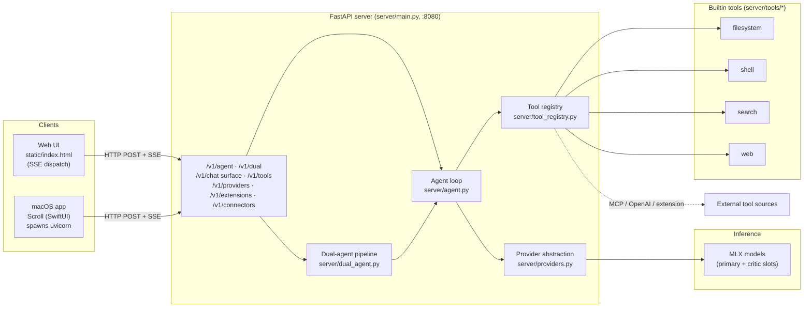

# Scroll — Architecture

## 1. Overview

Scroll is a **local-first AI coding agent** that runs large language models entirely on Apple Silicon via [`mlx-lm`](https://github.com/ml-explore/mlx-lm). A **FastAPI** backend hosts the inference loop and exposes an **OpenAI-compatible surface** alongside agent-specific endpoints; a single-page **web UI** consumes a Server-Sent-Events (SSE) token/tool stream, and a thin **SwiftUI macOS client** wraps the same server (it launches `uvicorn` as a child process and talks to it over `127.0.0.1`). With the default MLX provider the system needs **no network at all** — the model, the tool execution, and the UI all run on the user's machine. Providers and tools are **pluggable**: inference can be redirected to OpenAI or Anthropic, and the tool set can be enabled/disabled or extended at runtime via Python extension files, MCP connectors, or OpenAI-compatible connectors.

---

## 2. System diagram



---

## 3. Components

### 3.1 Inference server (FastAPI)

`server/main.py` defines the app. On startup, a `lifespan` context manager loads the **primary** model into a named slot (off the event loop, via `run_in_executor`) so the first request is warm. The **critic** model is lazy-loaded on the first `/v1/dual` request. Static files are served from `static/`; `GET /` returns `static/index.html`. CORS is wide open (`allow_origins=["*"]`) for local development.

SSE endpoints run the (synchronous, blocking) inference generator on a background `threading.Thread`, marshalling each `AgentEvent` back onto the asyncio loop through an `asyncio.Queue`, and emit them as `data: <json>\n\n` frames terminated by `data: [DONE]\n\n`.

| Method | Path | Purpose |
|---|---|---|
| `GET`  | `/` | Serve the web UI (`static/index.html`) |
| `POST` | `/v1/agent` | Single-agent run. SSE stream of `AgentEvent`s when `stream=true`; when `stream=false`, collects tokens and returns `{"content": "..."}` |
| `POST` | `/v1/dual` | Dual-agent pipeline (PRIMARY → CRITIC → REVISION), always SSE |
| `GET`  | `/v1/model` | Configured `primary`/`critic` model IDs + which slots are loaded |
| `GET`  | `/health` | `{"status":"ok","loaded_slots":[...]}` (used by the macOS app to poll readiness) |
| `GET`  | `/v1/providers` | List providers with `available`/`active` flags |
| `POST` | `/v1/providers/select` | Set the active provider (`{"provider":"mlx"\|"openai"\|"anthropic"}`) |
| `GET`  | `/v1/tools` | List registered tools (`name`, `source`, `enabled`, `description`) |
| `POST` | `/v1/tools/{name}/enable` | Re-enable a tool |
| `POST` | `/v1/tools/{name}/disable` | Disable a tool (hides it from the model) |
| `POST` | `/v1/tools/{name}/unregister` | Remove a non-builtin tool (builtins reject this — disable instead) |
| `POST` | `/v1/extensions` | Load tools from a local Python extension file (`{"path": "..."}`) |
| `POST` | `/v1/connectors/mcp` | Register tools from an MCP HTTP server (`{"server_url": "..."}`) |
| `POST` | `/v1/connectors/openai` | Register tools from an OpenAI-compatible tool server (`{"tool_defs":[...],"base_url":"...","api_key":""}`) |

> Note: the module docstring references an OpenAI-compatible `/v1/chat/completions` surface as the design intent; the routes implemented today are the agent/dual/management endpoints above.

### 3.2 Agent loop

`server/agent.py` is the core tool-use cycle. Models live in a **named registry** (`_registry: dict[str, (model, tokenizer)]`) keyed by slot name (`"primary"`, `"critic"`), so multiple models can be resident at once.

`run_agent(...)` iterates up to **`max_iterations = 12`** times:

1. **Build prompt** — `tokenizer.apply_chat_template(messages, tools=TOOL_DEFINITIONS, add_generation_prompt=True)`. If the tokenizer has no tool-template support, it falls back to injecting the tool JSON schema into the system message.
2. **Stream tokens** — `mlx_lm.stream_generate(model, tokenizer, prompt=..., max_tokens=..., sampler=make_sampler(temp=temperature))`. Each chunk is appended to the running response and emitted as a `token` event. Internal `<think>…</think>` spans are stripped before tokens are shown to the client and before history is stored.
3. **Parse tool calls** — the model is expected to emit `<tool_call>{ "name": ..., "arguments": {...} }</tool_call>`. The regex `<tool_call>\s*(.*?)\s*</tool_call>` extracts each block; the JSON is parsed and assigned a synthetic id `call_<8hex>`.
4. **Terminate or execute** — if there are **no** tool calls, the assistant turn is appended to history and the loop ends. Otherwise, for each call a `tool_call` event is emitted, the function is looked up in `TOOL_REGISTRY` and invoked as `fn(cwd=cwd, **arguments)`, and a `tool_result` event is emitted (`error=True` when output starts with `ERROR:` or the call raises). The tool output is appended to history as a `role:"tool"` message and the loop repeats.

If iteration 12 is reached with unresolved tool calls, an `error` event ("Reached max tool iterations…") is emitted. Every run ends with a `done` event carrying `total_tokens`.

### 3.3 Dual-agent pipeline

`server/dual_agent.py` orchestrates three phases over two model slots (large `primary`, small `critic`). Each phase boundary emits a `phase` event.

- **PRIMARY** — runs the full `run_agent` loop (with tools) to solve the task. Tool results are summarized into a short log (`Tool \`name\` → OK/ERROR: <first 300 chars>`) for the critic.
- **CRITIC** — runs on the `critic` slot with `CRITIC_SYSTEM_PROMPT`, `temperature=0.1` (deterministic), and `max_tokens // 2`. It receives the original task, the primary's solution, and the tool log, and may use tools (`run_command`, `read_file`, `grep_codebase`) to verify. It must end with one line: `VERDICT: LGTM` | `VERDICT: ISSUES` | `VERDICT: CRITICAL`. The verdict is parsed (default `ISSUES` if absent) and emitted as a `verdict` event.
- **REVISION** — runs **only if `revision=True` and verdict ≠ LGTM**. The primary slot is re-invoked with `REVISION_SYSTEM_PROMPT` plus the critic's findings, instructed to make surgical, targeted fixes.

A single `done` event (aggregated `total_tokens` across phases) closes the stream.

### 3.4 Tool registry

Builtins are declared in `server/tools/__init__.py` as two parallel structures: `TOOL_REGISTRY` (name → callable) and `TOOL_DEFINITIONS` (list of OpenAI function-calling schemas). `server/tool_registry.py` wraps these live objects in a `ToolManager` singleton (`tool_manager`) that **mutates them in place**, so the agent loop picks up enable/disable/register/unregister changes with no restart.

Each tool callable takes `cwd` plus its schema args and returns a string; relative paths resolve against `cwd`. Returning a string prefixed `ERROR:` marks the result as an error in the stream.

| Tool | Signature (kwargs beyond `cwd`) | Description |
|---|---|---|
| `read_file` | `path` *(req)*, `start_line?`, `end_line?` | Read a file, optionally a 1-indexed line slice |
| `write_file` | `path` *(req)*, `content` *(req)* | Write a file, creating parent dirs |
| `list_dir` | `path?`, `recursive=False` | List a directory (dirs suffixed `/`) |
| `run_command` | `command` *(req)*, `timeout?` | Run a shell command in `cwd` (default 60 s timeout) |
| `grep_codebase` | `pattern` *(req)*, `path?`, `include?`, `case_sensitive=True`, `max_results=50` | `grep -rn` over files, optional glob `--include` |
| `find_files` | `pattern` *(req)*, `path?` | Find files by `rglob` glob pattern |
| `fetch_url` | `url` *(req)*, `max_chars=20000` | Fetch a URL; strips HTML to text, truncates |

**Safety:** `run_command` rejects commands containing any pattern in `SHELL_BLOCKED` (`rm -rf /`, `dd if=`, `mkfs`, fork bomb, `> /dev/`, `chmod 777 /`) and enforces `SHELL_TIMEOUT`. This is a naive substring guard, not a sandbox.

**Extension contract** — a Python file exposing:

```python
TOOLS = [
    ("tool_name", callable, schema_dict),  # schema_dict = OpenAI function-calling schema
]
```

`ToolManager.register()` adds/replaces the callable in `TOOL_REGISTRY` and the schema in `TOOL_DEFINITIONS`. Builtins (`source="builtin"`) can be disabled but not unregistered.

### 3.5 Providers

`server/providers.py` defines a `Provider` base (`available()`, `stream(...)`) and a registry with active-provider selection. Default active provider is **`mlx`**.

| Provider | `id` | Availability | Notes |
|---|---|---|---|
| MLX (local) | `mlx` | model slot loaded | Apple Silicon; delegates to `agent.run_agent` on a slot |
| OpenAI | `openai` | `OPENAI_API_KEY` set | Streams chat completions; needs `openai` package |
| Anthropic | `anthropic` | `ANTHROPIC_API_KEY` set | Converts OpenAI-style tool defs to Anthropic `input_schema`; needs `anthropic` package |

The agent loop itself always drives the MLX slot directly. The provider layer is the alternate path for chat-style / remote inference; the default local path requires no API keys and no network.

### 3.6 Streaming protocol (SSE)

All streaming endpoints emit `text/event-stream` frames of the form `data: <json>\n\n`, ending with `data: [DONE]\n\n`. Each JSON payload has a `type` discriminator (Pydantic models in `server/schemas.py`, union `AgentEvent`). The web UI's `dispatch(evt, onTok)` switches on `evt.type`:

| `type` | Emitted by | Shape |
|---|---|---|
| `token` | agent + dual | `{"type":"token","content":"def "}` |
| `tool_call` | agent + dual | `{"type":"tool_call","id":"call_1a2b3c4d","name":"write_file","arguments":{"path":"main.py","content":"..."}}` |
| `tool_result` | agent + dual | `{"type":"tool_result","id":"call_1a2b3c4d","name":"write_file","output":"Written 812 bytes to /…/main.py","error":false}` |
| `phase` | dual only | `{"type":"phase","name":"critic","model":"critic"}` |
| `verdict` | dual only | `{"type":"verdict","verdict":"ISSUES"}` |
| `done` | agent + dual | `{"type":"done","total_tokens":1342}` |
| `error` | agent + dual | `{"type":"error","message":"Reached max tool iterations without final answer."}` |

Client handling, per `static/index.html`:

- `token` → appended to the live assistant bubble (cursor follows).
- `tool_call` / `tool_result` → rendered as inline tool rows **and** fed into the build-graph (see §6).
- `phase` → drives the PRIMARY/CRITIC/REVISION Gantt timeline and operative status cards.
- `verdict` → rendered as a verdict chip.
- `done` → resets the active operative to idle.
- `error` → shown as an error row.

> The macOS client decodes only `token`, `tool_call`, `tool_result`, `done`, and `error` (`Models/AgentEvent.swift`); it consumes the single-agent `/v1/agent` endpoint, so it does not handle `phase`/`verdict`.

---

## 4. Data flow (single request, end to end)

1. **Client → server.** The web UI POSTs to `/v1/agent` (or `/v1/dual` if dual-agent mode is on) with `{messages, cwd, stream:true, max_tokens, temperature}`.
2. **Stream setup.** `main.py` spawns a worker thread running `agent.run_agent(...)`; events flow back via an `asyncio.Queue` and are serialized as SSE frames.
3. **Iterate.** The agent builds the chat-templated prompt (with tool schemas), then calls `mlx_lm.stream_generate`. Each generated chunk → a `token` event (after `<think>` stripping).
4. **Tool cycle.** When the completed turn contains `<tool_call>…</tool_call>`, each call emits `tool_call`, executes against `TOOL_REGISTRY` with `cwd`, emits `tool_result`, and appends a `tool` message to history. The loop regenerates with the new context (up to 12 iterations).
5. **Finish.** A turn with no tool calls ends the loop; a final `done` event (with `total_tokens`) is sent, then `[DONE]`.
6. **Client render.** Tokens stream into the assistant bubble; tool rows and the build-graph update live; on `done`/`[DONE]` the assistant message is committed to the conversation.

(Dual mode wraps this: PRIMARY run → `phase:critic` → critic run → `verdict` → optional `phase:revision` → revision run → single `done`.)

---

## 5. Extending it

### Add a tool

1. Implement `def my_tool(path: str, cwd: str, ...) -> str:` (return `ERROR: …` on failure).
2. Register it — either edit the builtins (`server/tools/__init__.py`: add to `TOOL_REGISTRY` + `TOOL_DEFINITIONS`), or ship an **extension file**:
   ```python
   # my_ext.py
   def my_tool(thing: str, cwd: str) -> str: ...
   TOOLS = [("my_tool", my_tool, {
       "type": "function",
       "function": {"name": "my_tool", "description": "...",
                    "parameters": {"type":"object","properties":{"thing":{"type":"string"}},"required":["thing"]}},
   })]
   ```
   Then `POST /v1/extensions` with `{"path": "/abs/path/my_ext.py"}`. It is live immediately; toggle with `/v1/tools/{name}/disable|enable`.

### Add a provider

Subclass `Provider` in `server/providers.py` (implement `available()` and a streaming `stream(...)` generator that yields `TokenEvent`/`DoneEvent`/`ErrorEvent`), then `register_provider("name", MyProvider())`. Select it at runtime via `POST /v1/providers/select`.

### Load an MCP / OpenAI connector

- **MCP:** `POST /v1/connectors/mcp` with `{"server_url":"http://host:port"}`. The manager `GET {server_url}/tools`, registers a proxy for each, and routes calls to `POST {server_url}/tools/{name}/run` with `{"args": {...}}`.
- **OpenAI-compatible:** `POST /v1/connectors/openai` with `{"tool_defs":[...schemas...], "base_url":"...", "api_key":""}`. Each tool proxies to `POST {base_url}/{name}` (Bearer auth if a key is given).

Connector-sourced tools appear in `/v1/tools` tagged with their `source` (`mcp:…`, `openai-connector:…`, `extension:…`) and can be disabled/unregistered like any non-builtin.

---

## 6. Artifacts & lineage model

The agent's durable artifacts are the **files it writes** via `write_file` (and any side effects of `run_command`), produced under the request `cwd`. Beyond the raw files, the web UI maintains an in-memory **build-graph** (`BGR = {nodes, edges}` in `static/index.html`) that records the causal chain of operations as they stream:

- **Nodes** are files/operations, derived from each `tool_call`. A node is named from `args.path`/`args.file_path`/`args.command` (basename) and typed by the tool: `write` (write/create/edit), `read` (read/view/get), or `run` (run/exec/shell). Repeated touches increment the node's count.
- **Edges** are the **causal chain**: each new node links from the previously created node (`lastId → id`), giving a temporal/causal ordering of how the build unfolded.

The graph is rendered live (with node/edge counts) and is the basis for the fuller "intelligence snapshot" view, which also overlays operatives, tools, and connector/provider sources. Conceptually this is a **lineage and recoverability** substrate: by retaining what was read/written/run and in what order, the chain shows how each artifact came to exist and provides the seam for future replay/recovery features. Today the graph is client-side and per-session (cleared on new conversation); persisting it server-side is a natural next step.

---

## 7. Running it

**Prerequisites:** Apple Silicon Mac, [`uv`](https://docs.astral.sh/uv/), and enough RAM for the chosen model (the default 32B-4bit needs ~19 GB).

```bash
# from the repo root
uv run uvicorn server.main:app --port 8080
```

- **Default port:** `8080` (override with `MLX_PORT`).
- **Web UI:** open `http://127.0.0.1:8080/` (served from `static/index.html`).
- **CLI:** `uv run python cli.py --cwd /path/to/project` (interactive REPL against the same server).
- **macOS app:** `open Scroll/Scroll.xcodeproj`, then Build & Run — the app finds `uv`, launches `uvicorn server.main:app --host 127.0.0.1 --port 8080`, polls `/health` until ready, and drives the agent over SSE.

**Key environment variables** (`server/config.py`):

| Var | Default | Purpose |
|---|---|---|
| `MLX_MODEL` | `mlx-community/Qwen2.5-Coder-32B-Instruct-4bit` | Primary model |
| `MLX_CRITIC_MODEL` | `mlx-community/Qwen2.5-Coder-7B-Instruct-4bit` | Critic model (dual mode) |
| `MLX_PORT` | `8080` | Server port |
| `MLX_MAX_TOKENS` | `8192` | Max tokens per generation |
| `MLX_TEMPERATURE` | `0.15` | Sampling temperature |
| `MLX_SHELL_TIMEOUT` | `60` | `run_command` timeout (s) |

---

## Stack summary

- **Languages:** Python ≥ 3.11 (server, CLI), Swift 5.10 / SwiftUI (macOS app, deployment target macOS 14), HTML/CSS/JS (web UI, single file).
- **Inference:** `mlx-lm` ≥ 0.31.3 on Apple Silicon (`stream_generate` + `make_sampler`).
- **Backend:** FastAPI ≥ 0.137, Uvicorn ≥ 0.49 (`uvicorn[standard]`), Pydantic ≥ 2.13, httpx ≥ 0.28; CLI uses Click ≥ 8.4 + Rich ≥ 15.
- **Optional remote providers:** `openai` and `anthropic` SDKs (only if those providers are selected).
- **Default model IDs:** primary `mlx-community/Qwen2.5-Coder-32B-Instruct-4bit`, critic `mlx-community/Qwen2.5-Coder-7B-Instruct-4bit` (smaller swaps documented: 7B / 14B 4-bit variants).
- **macOS packaging:** XcodeGen (`Scroll/project.yml`), app sandbox disabled to allow localhost networking.
